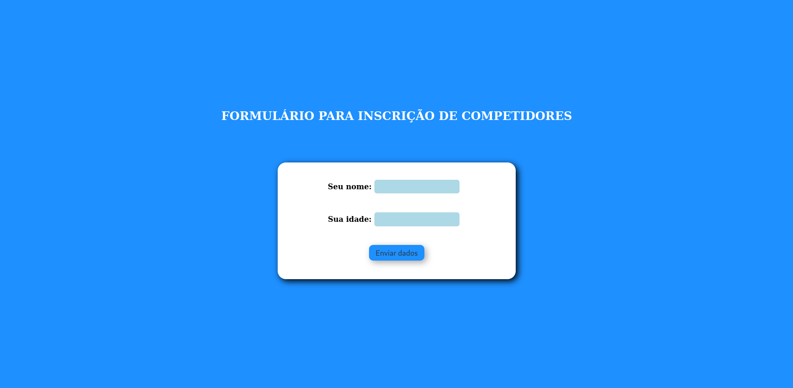
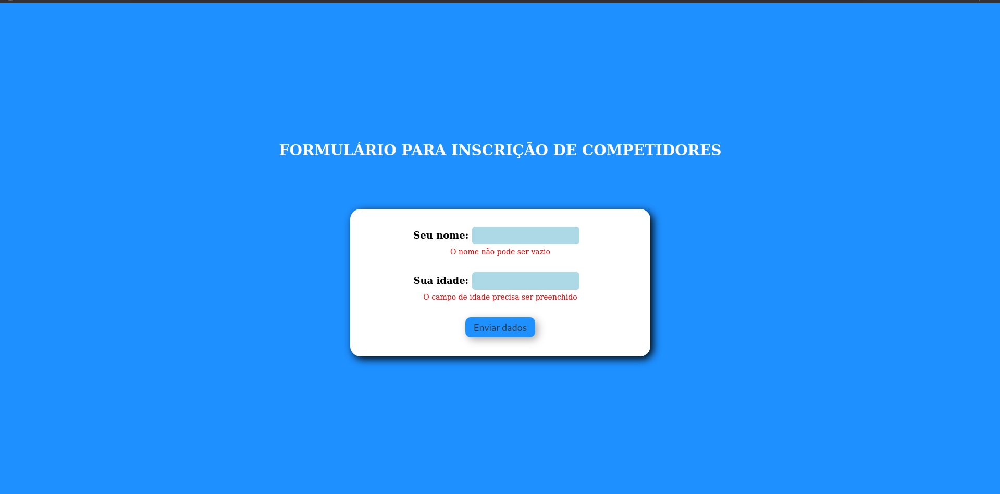
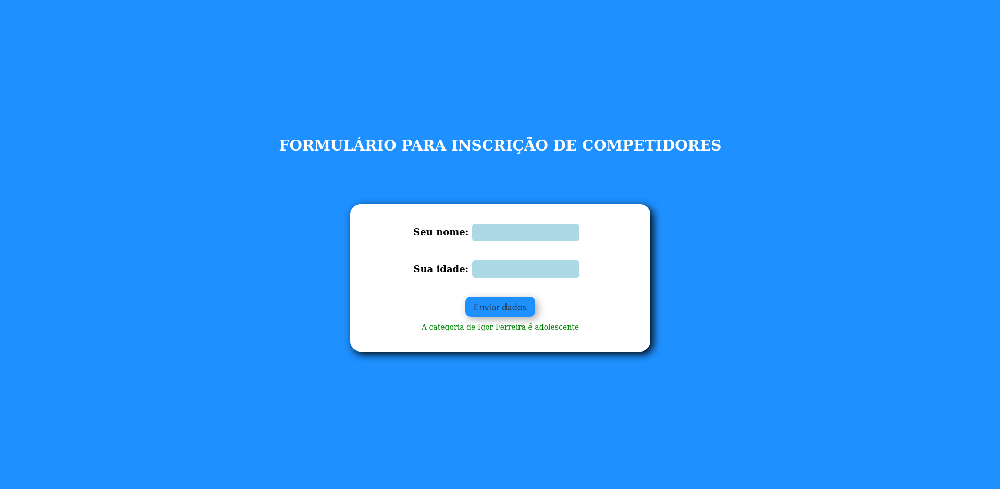

## Introdução a PHP

* Praticando PHP com:
  * Validação de formulários;
  * Encapsulamento de código a partir de funções;
  * Utilização de SESSIONS;
  * Manipulação de headers.

* Projeto realizado durante o curso de Introdução a PHP da plataforma <a href="https://www.dio.me/en">DIO</a>.
* Consiste em um formulário que recebe um nome e uma idade e classifica o usuário em uma categoria de natação a partir da idade.
* Para visualizar o resultado final, será necessário utilizar um servidor, durante o desenvolvimento foi utilizado o Apache, disponível no <a href="https://www.apachefriends.org/">XAMPP</a>.
* Após baixar o projeto, ele deve ser colocado na pasta "XAMPP/htdocs/" no diretório raíz da sua máquina. Então é só digitar "localhost" em seu navegador e procurar pelo projeto.

    
    
    

